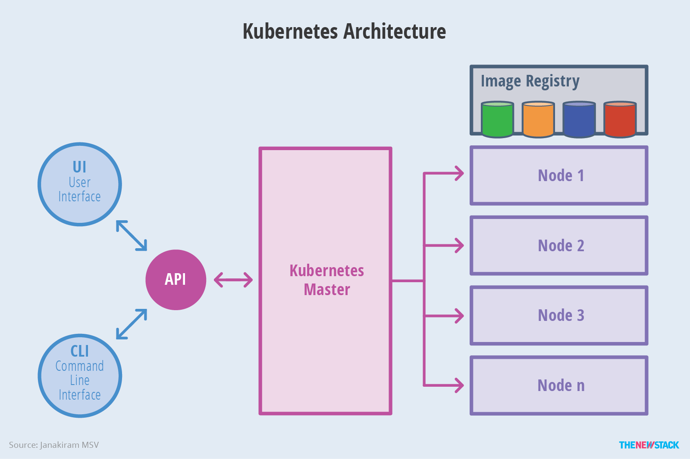
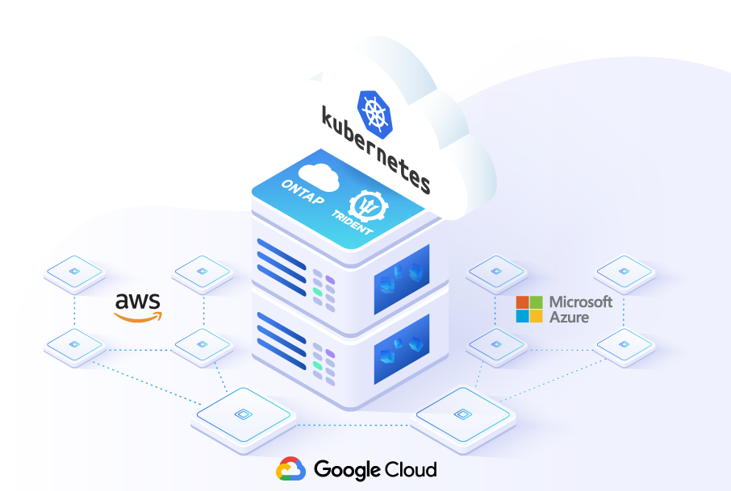

FIGURA 1  - GERAL





# Kubernetes gerenciado pelo provedor vs. Kubernetes autogerenciado

Implantamos o cluster Kubernetes em serviços Kubernetes gerenciados pelo provedor, como Amazon Elastic Kubernetes Service (EKS) e Google Kubernetes Engine (GKE), e manualmente pelo Rancheranteriores. Ao fazer isso, vimos que não temos que gerenciar o nó mestre ou plano de controle do cluster e só temos que nos preocupar em como implantar e selecionar o tipo de instância. Além disso, todas as outras preocupações são tratadas pelos fornecedores.

Alguns recursos são universais entre os três provedores.

Todos os três provedores oferecem fácil integração com seus outros serviços. Isso não apenas facilitará as operações, mas também ajudará na disponibilidade.

Em termos do próprio serviço Kubernetes, todos eles implantam e mantêm o plano de controle para você, então você só precisa se preocupar com os nós. Dessa forma, você pode se concentrar mais em suas aplicações.

Mas, embora a funcionalidade principal do Kubernetes seja geralmente a mesma, os recursos que cada provedor de nuvem oferece podem ser muito diferentes. Então, como escolhemos onde executar nosso cluster Kubernetes? Continue lendo enquanto comparamos AKS, EKS e GKE para ver qual pode ser o melhor para você.


## Nó Mestre



O nó mestre gerencia o cluster e é responsável por manter o estado do cluster. Para nos comunicarmos com os nós mestres, usamos a ferramenta de cliente Kubernetes Kubectl. Com o Kubectl, podemos facilmente emitir comandos para que nossos nós mestres funcionem de acordo. O nó mestre é usado para gerenciar o estado do cluster e pode ser replicado para alta disponibilidade. O nó mestre tem os seguintes componentes para gerenciar e controlar o estado do cluster:

1. Kube-APIServer: Todas as comunicações externas podem ser feitas com o servidor API
2. Kube-controller-manager: Kube-controller-manager é um daemon, que observa o estado do cluster
3. ETCD: Etcd é um banco de dados de par de valores-chave que armazena o estado do cluster
4. Programador Kube: programa atividades para nós de trabalho com base no armazenamento de eventos no banco de dados etcd


# Serviços Kubernetes gerenciados pelo provedor



Até agora, vimos o que é um nó mestre e a finalidade que ele serve para nós de cluster. Provedores de nuvem, no entanto, têm seu próprio serviço Kubernetes gerenciado, como serviço Amazon Elastic Kubernetes, Google Kubernetes Engine ou serviço Azure Kubernetes. Esses provedores de nuvem gerenciam o nó mestre para você imediatamente. Você não precisa provisionar ou gerenciar o nó mestre. As versões gerenciadas variam de diferentes provedores de nuvem, alguns vão tão longe a ponto de oferecer suporte dedicado, ambientes pré-configurados e hospedagem.


# Qual serviço Kubernetes gerenciado do provedor de nuvem é o melhor?

KUBERNETES VS KUBERNETES

Se você já investiu em um dos três principais provedores de nuvem, faz sentido continuar a usar esse serviço. Todos os três são fortes candidatos.

Mas há benefícios e recursos exclusivos em todos os serviços gerenciados do Kubernetes abordados abaixo. O serviço Kubernetes gerenciado do provedor de nuvem que você usa realmente depende da situação.

O Amazon Elastic Kubernetes Service (EKS) é o serviço Kubernetes gerenciado mais amplamente usado.

Se você não está comprometido com um provedor de nuvem, pode considerar o Google Kubernetes Engine (GKE). O GKE tem a maioria dos recursos e capacidades automatizadas.

O Azure Kubernetes Service (AKS) pode ser a opção mais econômica e se integra bem a todos os recursos da Microsoft.

Vamos nos aprofundar nos prós e contras e nas diferenças de recursos entre cada provedor. 

Lembre-se de que, como a nuvem evolui muito rapidamente, alguns dos detalhes na comparação abaixo podem ter mudado no momento em que você leu isto.


## 1 - Google Kubernetes Engine - GKE

FIGURA GKE

O Kubernetes foi criado pelo Google para sua própria ferramenta de orquestração de contêineres, inicialmente chamada de BORG, mais tarde eles mudaram seu nome para Omega - essa longa história é o motivo de ele ser considerado o serviço Kubernetes gerenciado mais avançado. Ele também inclui uma verificação de integridade e reparo automático de microsserviços, registro e monitoramento com um driver de pilha. Além disso, ele vem com escalonamento automático de quatro vias e suporte a vários clusters.

Alguns dos principais recursos do serviço Google Kubernetes são:

Começa rapidamente com clusters de clique único
Aproveita um plano de controle de alta disponibilidade, incluindo clusters multi-zonais e regionais
Elimina a sobrecarga operacional com canais de reparo, atualização automática e liberação
É seguro por padrão, incluindo verificação de vulnerabilidade de imagens de contêiner e criptografia de dados
Monitoramento de nuvem integrado com infraestrutura, aplicativo e visualizações específicas do Kubernetes
Recurso de escalonamento automático de quatro vias

Escalonamento automático de pod horizontal com base na utilização de CPU ou métricas personalizadas, escalonamento automático de cluster que funciona por grupo de nós e escalonamento automático de pod vertical que verifica automaticamente o uso de CPU e memória de pods e ajusta dinamicamente seus aplicativos de CPU e memória em resposta. Escala automaticamente o grupo de nós e clusters em vários grupos de nós, com base em qualquer mudança nos requisitos de carga de trabalho.

A maneira mais simples de iniciar um cluster Kubernetes no GKE é:

```sh
$ gcloud container clusters create magalix
```

Google Cloud Platform (GCP), ou gcloud, é a interface de linha de comando que você pode usar para criar, excluir ou gerenciar a maioria dos serviços em nuvem do GCP. Aqui, estamos criando um cluster chamado magalix com o número padrão de nós (3). Com apenas uma linha de código, o cluster foi implantado e será gerenciado pelo GCP. O código acima criará um nó mestre, 3 nós de trabalho e um ambiente pré-configurado para você.

Nota: Isso será implantado em um ID de projeto padrão
Custo: o GKE cobra US $ 0,10 centavos por hora pelo gerenciamento de cluster do Kubernetes e pelos serviços subjacentes de acordo com uma escala de preços.


### Prós e contras do Google Kubernetes Engine (GKE)

Se você não tem nenhum investimento em infraestrutura de nuvem ou está trabalhando em um ambiente com várias nuvens, pode fazer sentido olhar para o GKE. Ele possui a maioria dos recursos prontos para uso e oferece os recursos mais automatizados.

## Pontos fortes do GKE

- O GKE tem as versões mais disponíveis dos três serviços gerenciados.
- Existem atualizações automáticas para o plano de controle e nós.
- Dependendo de suas necessidades, você pode se inscrever em canais de lançamento Rápido, Regular ou Estável para testar automaticamente novas versões.
- O GKE fornece reparo automático da integridade do nó.
- Você pode usar um Container-Optimized OS para os nós, que são mantidos pelo Google para fornecer melhor segurança e estabilidade.
- Há um painel integrado intuitivo com monitoramento e registro de todos os componentes usando o pacote de operações do Google Cloud.
- Para um ambiente de desenvolvedor, você pode utilizar a extensão Cloud Code para Visual Studio Code e IntelliJ.

## Pontos fracos do GKE

- Apenas um cluster zonal é gratuito.
- O GKE só corresponderá ao SLA de EKS 99,95% se você usar clusters regionais, que custa US $ 0,10 por cluster por hora.
- O GKE não tem nuvem governamental, portanto, não há suporte para nuvem governamental.


## 2 - Serviço Amazon Elastic Kubernetes - EKS

FIGRUA EKS

O serviço Amazon Web tem seu próprio serviço Kubernetes gerenciado, denominado EKS. É também outro serviço Kubernetes gerenciado em que você não precisa manter ou criar o plano de controle do cluster. O EKS executa um plano de controle de cluster em vários AZ para garantir que mantenha a alta disponibilidade e substitua automaticamente as instâncias não íntegras. Ele funciona com diferentes AWS para fornecer escalabilidade e segurança para seu aplicativo, como o seguinte:

- Amazon ECR para imagens de contêiner
- Elastic Load Balancing para distribuição de carga
- IAM para autenticação
- Amazon VPC para isolamento
- A maneira mais simples de iniciar um cluster Kubernetes no EKS é Eksctl: EKsctl é a ferramenta EKS CLI para interagir com o cluster.

1. Para criar um cluster usando Fargate, ou seja, implantação sem servidor:

```sh
eksctl create cluster --name magalix --region us-west-1 --fargate
```
Este comando cria o cluster magalix na região us-west-1 (North Virginia) usando Fargate. Nesse caso, não especificamos um número de nós.

2. Para criar um cluster usando máquinas EC2, ou seja, máquina virtual AWS:
```sh 
eksctl create cluster --name magalix --region us-west-1 --nodegroup-name standard-workers --node-type t3.medium --nodes 3 --nodes-min 1 --nodes-max 4 --managed
```
Este comando cria o cluster magalix na região us-west-1 (North Virginia) em máquinas EC2 com um grupo de nós gerenciados chamado standard-workers, tipo de instância como t3.medium e com escalonamento automático mín-máx de 1 a 4 .

Nota: Isso será implantado em uma região padrão
Custo: o EKS cobra US $ 0,10 por hora pelo gerenciamento do cluster Kubernetes e pelos serviços subjacentes de acordo com uma escala de preços.


## Amazon Elastic Kubernetes Service (EKS) pros and cons

EKS is the most widely used managed Kubernetes services, according to a survey from the CCNF. But EKS has the least amount of pre-configured solutions, so it will require more manual configuration. While this may mean that you have more control over your cluster, it also requires more time focused on operations.


## EKS strengths	
- Integration with the strong AWS ecosystem.
- There is a 99.95% Service Level Agreement.16	
- EKS makes it very easy to apply a Pod Security Policy, which applies cluster-wide.17	
- AWS GovCloud is a supported region.18


## EKS weaknesses
- Out of the three providers, EKS has the most manual steps to upgrade the Cluster components.19
- There is no automatic node health repair.20
- Logging and monitoring can be configured in Amazon CloudWatch Container Insights 21, but the service is not intuitive.
- Price is more expensive than AKS at $0.10 per cluster per hour.22
- You have to install upgrades for the VPC CNI yourself.23
- You have to install Calico CNI yourself.24
- There is no IDE extension for developing EKS code.


## 3 - Serviço Azure Kubernetes - AKS

FIGURA DO AKS

O AKS também é um serviço Kubernetes gerenciado, que reduz a complexidade e a sobrecarga operacional do gerenciamento do Kubernetes, transferindo grande parte dessa responsabilidade para o Azure. O AKS lida com todas as suas tarefas críticas, monitoramento de integridade e manutenção para você. Ele oferece Kubernetes sem servidor, uma integração contínua integrada e experiência de entrega contínua (CI / CD) e segurança e governança de nível empresarial.

A maneira mais simples de iniciar um cluster Kubernetes em AKS é:

```sh
az group create --name mine --location eastus
```

Isso criará o grupo de recursos da mina no local Eastus:

```sh
az aks create --resource-group mine --name magalix --node-count 1 --enable-addons monitoring --generate-ssh-keys
```
Este comando criará um cluster de nome magalix no grupo de recursos da mina com um nó de trabalho e monitoramento habilitado.

Custo: AKS não cobra nada pelo gerenciamento do cluster Kubernetes. Ele cobra apenas por seus serviços subjacentes.


If you’re already in the Microsoft and Azure world, it makes sense to use AKS. It integrates well with the other Microsoft Azure features, such as Azure Active Directory. And it might be the most cost-effective service as you do not have to pay for the Control Plane. 

### AKS strengths

- AKS has been the fastest to provide the newer Kubernetes versions as well as minor patches.1
- AKS provides automatic node health repair.
- The Control Plane is free; you are only charged per node.
- AKS has integration with Azure Policy.
- Azure Monitor5 and Application Insights6 are available for monitoring and logging.
- Azure Network Policies and Calico Network Policies can be set up automatically when a cluster is created.7
- There is seamless integration with Azure Active Directory.8	
- AKS has availability in Azure Government.9
- There is a good developer environment. You can use the Kubernetes extension in Visual Studio Code to deploy to AKS.10 Or you can use the Bridge to Kubernetes service. This gives you the ability to run and debug code on a development machine as if it was a part of your cluster. This way, you don’t need to replicate all of the dependencies to your development machine.11


### AKS weaknesses

- As opposed to GKE, which is fully automatic, AKS has a semi-manual process to upgrade Cluster components to newer versions.12 However, a fully automatic solution is in development.13
- The network policies need to be enabled when creating the cluster and cannot be enabled on an existing cluster.


# Serviço Kubernetes autogerenciado

Vimos como é fácil implantar clusters Kubernetes em um serviço Kubernetes gerenciado, mas tudo tem seus prós e contras - com um serviço Kubernetes autogerenciado, temos mais comando sobre o plano de controle do cluster. No gerenciamento de serviços gerenciados, os componentes da camada são gerenciados pelo provedor.

Quando implantamos um cluster por meio de kubeadm, kubespray ou mesmo fazendo isso manualmente (da maneira mais difícil), você tem acesso total ao cluster e domina todos os outros componentes de gerenciamento relacionados. Você também terá mais controle sobre a implantação e administração de seu cluster. Por exemplo, você pode implementar vários grupos de nós ou escolher ter diferentes tipos de instância para diferentes nós. Essas opções não estão disponíveis em muitos serviços gerenciados do Kubernetes. Você pode implantar um serviço Kubernetes autogerenciado na nuvem do Google usando um mecanismo de computação como nós, AWS usando máquinas EC2 e Azure implantando-o nas máquinas virtuais do Azure.

Ferramentas usadas para criar ou gerenciar clusters do Kubernetes:

1. Kubespray

O Kubespray fornece um papel Ansible para implantação e configuração do Kubernetes. Ele pode ser usado em qualquer provedor de nuvem ou local. Ele usa Kubeadm sob o capô.

2. Kubeadm

O Kubeadm Bootstrap é um cluster Kubernetes de prática recomendada na infraestrutura existente. Ele usa o cluster Kubernetes viável mínimo possível.

3. Kops

Kops é uma ferramenta que pode ser usada para criar, excluir, atualizar e manter clusters Kubernetes altamente disponíveis e baseados em produção. O Kops permite que você gerencie todo o ciclo de vida do cluster do Kubernetes: da infraestrutura, provisionamento e exclusão do cluster.

4. Kubetail

É um pequeno script bash usado para agregar registros de vários pods em um único stream.

5. Kubewatch

Essa ferramenta é um observador do Kubernetes que publica o evento do Kubernetes para a equipe por meio do aplicativo de comunicação Slack. O Kubewatch é executado como um pod dentro dos clusters do Kubernetes e observa as mudanças que ocorrem no sistema.

6. Prometeus

Prometheus, uma famosa ferramenta usada para monitorar o cluster. É muito simples de integrar, mas extremamente poderoso.

7. HELM

HELM é um gerenciador de pacotes para Kubernetes. É como um npm, pip para Kubernetes. HELM opera no gráfico e você pode compartilhar sua aplicação através da criação de gráfico HELM.

8. Istio

Istio é uma malha de serviço de código aberto usada para facilitar a conexão, o gerenciamento e a segurança do tráfego. Ele observa a telemetria sobre microsserviços em execução em contêineres.

9. CoreDNS

É um conjunto de plug-ins escritos em GO que executa funções DNS. Os plug-ins CoreDNS com Kubernetes podem substituir o serviço Kube-DNS e implementar as especificações definidas para a descoberta de serviço baseada em DNS do Kubernetes.

10. Painel do Kubernetes

É uma IU da Web para o cluster Kubernetes e tem um painel nativo que facilita o monitoramento e a solução de problemas do cluster Kubernetes.


# Autogerenciado vs Gerenciada pelo provedor, o que escolher?

Ao escolher entre essas modalidades, temos que avaliar os requisitos, custo e flexibilidade do aplicativo. Se estamos optando pelo serviço Kubernetes gerenciado pelo provedor, percebemos que ele custa aproximadamente US $ 100 por mês apenas para o gerenciamento do cluster. Por outro lado, se optarmos pelo autogerenciamento, temos o tempo e a habilidade necessários para gerenciar o cluster Kubernetes? Definitivamente, vale a pena considerar. No entanto, quando se trata de flexibilidade, os serviços autogerenciados do Kubernetes nos oferecem muito mais opções. Em última análise, você terá que considerar os requisitos do aplicativo, o tempo disponível para tarefas de gerenciamento e o nível de habilidade.


